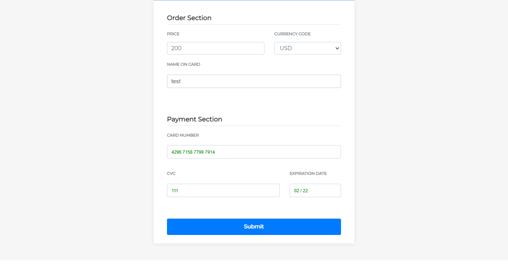

## Overview
I built a rest API for operations: create, update orders, to simulate the user usage for the library.

## Install Dependencies
```
# clone it
git clone git@github.com:mahmoudahmedd/payment-gateway-library.git

# Install dependencies for REST API
cd app
npm install

# Install dependencies for library
cd lib
npm install
```

## Screenshot
<p align="center">
  
</p>

## Set your Configuration

In configuration/config.js 
For example, PORT: 3000 

In index.html set your Replace YOUR-CLIENT-TOKEN with the client token that you generated
to generate YOUR-CLIENT-TOKEN

It's two steps
```
First, get <ACCESS_TOKEN>
curl -v https://api-m.sandbox.paypal.com/v1/oauth2/token \
  -H "Accept: application/json" \
  -H "Accept-Language: en_US" \
  -u "Ac5EsbEwf8ekC70vThh3bUG5271vBomALtNIWTgv5zLJbEKRizMUm6bkYHYkU7JI6faI0K0uZSO7lnGV:EIvnELvpgqq3-71a0bFPdng5LVisqWSj7wDhXY0RxZUv68749CVOFc2c8O-iSjquQMeau_wXrkwZQtO5" \
  -d "grant_type=client_credentials"

Second, get <CLIENT-TOKEN>
curl -X POST https://api-m.sandbox.paypal.com/v1/identity/generate-token \
-H 'Content-Type: application/json' \
-H 'Authorization: Bearer <ACCESS_TOKEN>' \
-H 'Accept-Language: en_US' \
```

## Data Example for credit card
number: <b>4296715877997914</b>
expiration date: <b>02/22</b>
cvv: <b>111</b>

## Testing
```
npm test
```
